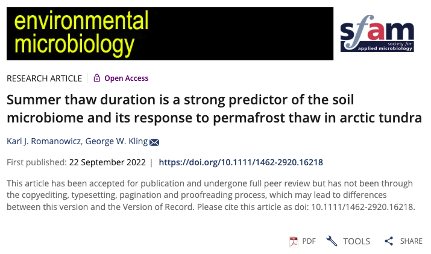
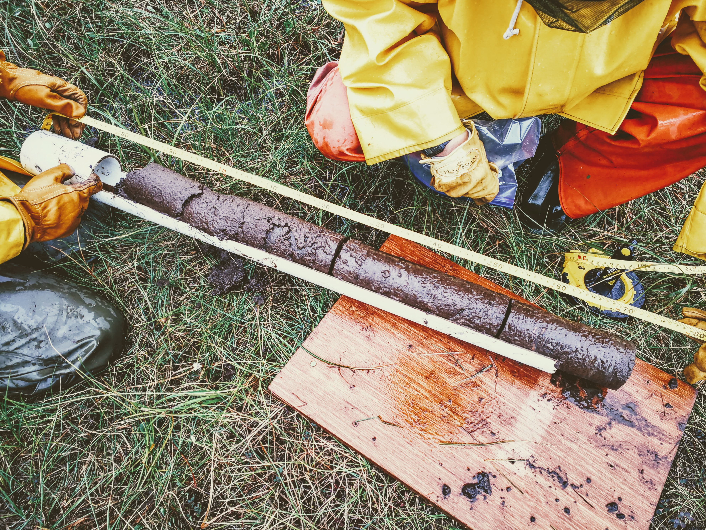

## Summer Thaw Duration is a Strong Predictor of the Soil Microbiome and its Response to Permafrost Thaw in Arctic Tundra

### [Karl J. Romanowicz](https://kromanowicz.github.io/) & George W. Kling
_____________________________________

Romanowicz KJ, Kling GW. (***In Press***) Summer thaw duration is a strong predictor of the soil microbiome and its response to permafrost thaw in Arctic tundra. Environmental Microbiology. [https://doi.org/10.1111/1462-2920.16218](https://doi.org/10.1111/1462-2920.16218)

**Links to Rendered Code:** 

[16S Analysis](https://rpubs.com/kjromano/AnnualThaw_16S_SILVA_Analysis)

[Soil Chemistry](https://rpubs.com/kjromano/AnnualThaw_SOIL_Analysis)

[Hierarchical Clustering](https://rpubs.com/kjromano/AnnualThaw_CLUSTER_SILVA_Analysis)

[Thaw Duration Correlation](https://rpubs.com/kjromano/AnnualThaw_CORR_SILVA_Analysis)

**NCBI BioProject:** [PRJNA794857](https://www.ncbi.nlm.nih.gov/bioproject/?term=PRJNA794857) for raw .fastq files

**Direct any questions regarding this repository to lead author:** [Karl J. Romanowicz](mailto:kjromano@umich.edu).
_____________________________________

**Manuscript Abstract:**

Climate warming has increased permafrost thaw in arctic tundra and extended the duration of annual thaw (number of thaw days in summer) along soil profiles. Predicting the microbial response to permafrost thaw depends largely on knowing how increased thaw duration affects the composition of the soil microbiome. Here we determined soil microbiome composition from the annually-thawed surface active layer down through permafrost from two tundra types at each of three sites on the North Slope of Alaska, USA. Variations in soil microbial taxa were found between sites up to ~90 km apart, between tundra types, and between soil depths.  Microbiome differences at a site were greatest across transitions from thawed to permafrost depths. Results from correlation analysis based on multi-decadal thaw surveys show that differences in thaw duration by depth were significantly positively correlated with the abundance of dominant taxa in the active layer and negatively correlated with dominant taxa in the permafrost. Microbiome composition within the transition zone was statistically similar to that in the permafrost, indicating that recent decades of intermittent thaw have not yet induced a shift from permafrost to active-layer microbes. We suggest that thaw duration rather than thaw frequency has a greater impact on the composition of microbial taxa within arctic soils.

